# 三个数据集迁移性与隐蔽性的详细分析报告

生成位置：`analysis/transfer_stealth_report_detailed.md`

这份报告只聚焦 `NC` 之外的主结果，即：迁移性采用目标域测试 ASR，隐蔽性采用 `STRIP / SentiNet / IBD-PSC / SCaLe-Up` 四种防御的平均表现。下面所有主结论都建立在这四种防御和当前三个数据集的完整实验结果上。

## 1. 指标与口径

- `transfer_rate`：目标域测试 ASR，越大表示跨域迁移越强。
- `stealth_auc_avg = 1 - mean(AUC)`：四种防御平均后的 AUC 型隐蔽性，越大越隐蔽。
- `stealth_tpr_avg = 1 - mean(TPR)`：四种防御平均后的 TPR 型隐蔽性，越大越隐蔽。
- `stealth_mean = (stealth_auc_avg + stealth_tpr_avg) / 2`：本报告用于主比较的综合隐蔽性。
- `tradeoff_hmean`：`transfer_rate` 与 `stealth_mean` 的调和均值，用于量化“迁移性-隐蔽性”折中。
- 当前 `tiny_imagenet` 的迁移性已改为后生成的 `target-domain` 结果，不再读取旧的 Tiny-ImageNet-C。
- 当前结果文件里的 `basic` 对应论文里常见的 `BadNet`，正文撰写时需要统一命名。

## 2. 数据完整性与解释边界

| dataset       | dataset_display                |   n_configs |   expected_records |   actual_records |   coverage_rate |
|:--------------|:-------------------------------|------------:|-------------------:|-----------------:|----------------:|
| cifar10       | CIFAR-10 -> STL-10             |         513 |               2052 |             2052 |          1      |
| tiny_imagenet | Tiny-ImageNet -> Target Domain |         465 |               1860 |             1859 |          0.9995 |
| mnistm        | MNIST-M -> MNIST               |         513 |               2052 |             2052 |          1      |
| overall       | overall                        |        1491 |               5964 |             5963 |          0.9998 |

- 四种防御的有效结果总覆盖率为 `5963/5964`，即 `0.9998`。主分析的数据覆盖是完整的。
- 真正缺失的有效记录只有 `1` 条，且仅影响 `tiny_imagenet / mobilenet / belt` 上的一条 `SentiNet` 结果，对整体结论没有方向性影响。
- 需要特别强调：高隐蔽性不一定意味着“成功绕过检测”。在某些情况下，高隐蔽性来自触发器在目标域根本激活不起来，典型例子就是 `MNIST-M -> MNIST` 上的 `SIG`。

## 3. 方法机理与先验预期

### 3.1 攻击方法

- `SIG`：正弦/频域型全局触发。没有明确局部区域，通常更难被局部解释型防御抓到；但若域转换破坏其频率结构，迁移会显著下滑。
- `WaNet`：几何形变触发。它不是加 patch，而是通过空间扭曲注入后门，往往对局部区域检测不敏感，且跨数据集表现高度依赖几何结构能否保留。
- `adaptive_blend`：自适应 blended trigger。与 blend 相比更强调 cover 与参数调节，目标是继续压低可见性。
- `adaptive_patch`：自适应局部 patch。仍然属于局部触发器，但参数与 cover 设计使其兼具 patch 强激活与一定伪装能力。
- `basic`：典型 BadNet/patch 攻击。触发器局部、显式、几何位置固定，通常最容易获得高 ASR 与高迁移，但也最容易暴露。
- `belt`：局部区域 + mask/cover 的混合型触发。几何上仍偏局部，但显著性不如 basic/adaptive_patch 那样尖锐。
- `blend`：全局像素混合触发。触发器分布在整幅图像上，显著性扩散，通常比 patch 更隐蔽，但是否迁移取决于域间低层统计是否保留。
- `upgd`：优化型小扰动触发。更接近对抗式后门，依赖模型与数据分布的细粒度耦合，因此可能在近域迁移上表现很好，但在大域移位下快速失效。

### 3.2 防御方法

- `STRIP`：输入混合熵检测。代码中通过把测试样本与多张干净样本叠加后计算预测熵来区分 clean/poison；如果触发器在混合后仍能稳定主导模型，熵会偏低，因此更适合抓强主导型 patch 或部分 blend。
- `SentiNet`：GradCAM 驱动的局部解释型检测。`other_defenses_tool_box/sentinet.py` 明确写有 `Only support localized attacks`，并使用显著区域替换/移植策略，因此天然偏向局部触发器。
- `SCaLe-Up`：输入强度缩放一致性检测。代码使用 `scale_set=[3,5,7,9,11]` 放大像素强度，并检查预测在多尺度下是否异常一致；只要触发器在缩放后仍然稳固地主导类别，它就更容易被抓到。
- `IBD_PSC`：模型内部 BN 参数放大的一致性检测。它不是看显著区域，而是看预测类别在参数缩放后的稳定度，因此对局部/全局/形变型触发器都更通用，往往是四种方法里覆盖面最宽的一种。

## 4. 总体统计

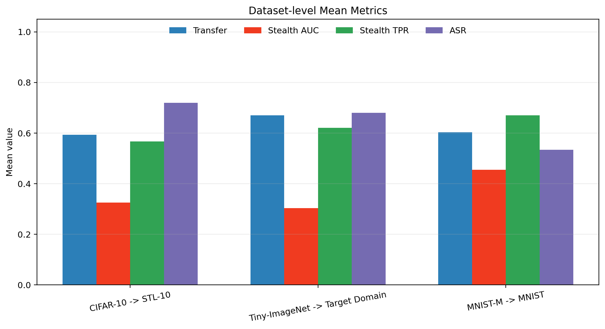

| dataset_display                |   n_points |   transfer_mean |   transfer_median |   stealth_auc_mean |   stealth_tpr_mean |   stealth_mean_mean |   asr_mean |   corr_transfer_stealth_mean |   corr_transfer_asr |
|:-------------------------------|-----------:|----------------:|------------------:|-------------------:|-------------------:|--------------------:|-----------:|-----------------------------:|--------------------:|
| CIFAR-10 -> STL-10             |        513 |          0.5927 |            0.6641 |             0.3255 |             0.5666 |              0.4461 |     0.7197 |                      -0.7133 |              0.7785 |
| Tiny-ImageNet -> Target Domain |        465 |          0.6697 |            0.8121 |             0.3034 |             0.6203 |              0.4618 |     0.68   |                      -0.6862 |              0.9654 |
| MNIST-M -> MNIST               |        513 |          0.6031 |            0.8379 |             0.4551 |             0.6703 |              0.5627 |     0.534  |                      -0.6737 |              0.9005 |

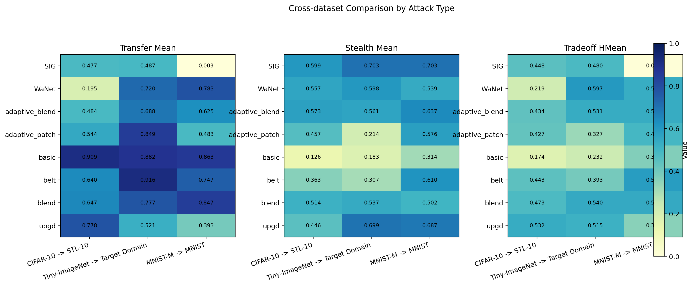

| attack_type    | dataset       |   transfer_mean |   stealth_mean_mean |   tradeoff_hmean_mean |   rank_transfer_mean |   rank_stealth_mean |   rank_tradeoff_mean |
|:---------------|:--------------|----------------:|--------------------:|----------------------:|---------------------:|--------------------:|---------------------:|
| SIG            | cifar10       |          0.4772 |              0.599  |                0.4484 |                    7 |                   1 |                    3 |
| SIG            | mnistm        |          0.0026 |              0.7027 |                0.0051 |                    8 |                   1 |                    8 |
| SIG            | tiny_imagenet |          0.284  |              0.7026 |                0.3074 |                    8 |                   1 |                    7 |
| WaNet          | cifar10       |          0.1951 |              0.5575 |                0.219  |                    8 |                   3 |                    7 |
| WaNet          | mnistm        |          0.7826 |              0.5388 |                0.5311 |                    3 |                   6 |                    4 |
| WaNet          | tiny_imagenet |          0.7251 |              0.5982 |                0.5985 |                    4 |                   3 |                    1 |
| adaptive_blend | cifar10       |          0.4844 |              0.5735 |                0.434  |                    6 |                   2 |                    5 |
| adaptive_blend | mnistm        |          0.6251 |              0.6374 |                0.5316 |                    5 |                   3 |                    3 |
| adaptive_blend | tiny_imagenet |          0.6021 |              0.5614 |                0.4869 |                    6 |                   4 |                    3 |
| adaptive_patch | cifar10       |          0.5439 |              0.4572 |                0.4275 |                    5 |                   5 |                    6 |
| adaptive_patch | mnistm        |          0.4828 |              0.5762 |                0.491  |                    6 |                   5 |                    5 |
| adaptive_patch | tiny_imagenet |          0.7773 |              0.2137 |                0.3164 |                    3 |                   7 |                    6 |
| basic          | cifar10       |          0.9093 |              0.1256 |                0.1736 |                    1 |                   8 |                    8 |
| basic          | mnistm        |          0.8626 |              0.3139 |                0.3691 |                    1 |                   8 |                    6 |
| basic          | tiny_imagenet |          0.8147 |              0.1835 |                0.2213 |                    2 |                   8 |                    8 |
| belt           | cifar10       |          0.6398 |              0.3627 |                0.4426 |                    4 |                   7 |                    4 |
| belt           | mnistm        |          0.7466 |              0.6104 |                0.5822 |                    4 |                   4 |                    1 |
| belt           | tiny_imagenet |          0.8867 |              0.3074 |                0.3885 |                    1 |                   6 |                    4 |
| blend          | cifar10       |          0.6475 |              0.5143 |                0.4732 |                    3 |                   4 |                    2 |
| blend          | mnistm        |          0.8466 |              0.5018 |                0.5417 |                    2 |                   7 |                    2 |
| blend          | tiny_imagenet |          0.7125 |              0.5373 |                0.5076 |                    5 |                   5 |                    2 |
| upgd           | cifar10       |          0.7776 |              0.4458 |                0.5321 |                    2 |                   6 |                    1 |
| upgd           | mnistm        |          0.3928 |              0.6874 |                0.3588 |                    7 |                   2 |                    7 |
| upgd           | tiny_imagenet |          0.3627 |              0.6989 |                0.3751 |                    7 |                   2 |                    5 |

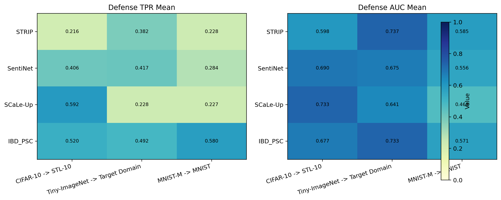

| dataset       | defense   |   n_points |   tpr_mean |   auc_mean |   tpr_std |   auc_std |   stealth_from_tpr |   stealth_from_auc |
|:--------------|:----------|-----------:|-----------:|-----------:|----------:|----------:|-------------------:|-------------------:|
| cifar10       | SCaLe-Up  |        513 |     0.5916 |     0.7329 |    0.2502 |    0.1434 |             0.4084 |             0.2671 |
| cifar10       | IBD_PSC   |        513 |     0.5199 |     0.677  |    0.3801 |    0.2364 |             0.4801 |             0.323  |
| cifar10       | SentiNet  |        513 |     0.4065 |     0.6902 |    0.3878 |    0.2236 |             0.5935 |             0.3098 |
| cifar10       | STRIP     |        513 |     0.2156 |     0.5977 |    0.2649 |    0.2086 |             0.7844 |             0.4023 |
| mnistm        | IBD_PSC   |        513 |     0.5796 |     0.571  |    0.3123 |    0.1974 |             0.4204 |             0.429  |
| mnistm        | SentiNet  |        513 |     0.2843 |     0.556  |    0.3771 |    0.2398 |             0.7157 |             0.444  |
| mnistm        | STRIP     |        513 |     0.2279 |     0.5847 |    0.2807 |    0.2045 |             0.7721 |             0.4153 |
| mnistm        | SCaLe-Up  |        513 |     0.227  |     0.4682 |    0.2587 |    0.1757 |             0.773  |             0.5318 |
| tiny_imagenet | IBD_PSC   |        465 |     0.492  |     0.7331 |    0.3891 |    0.2161 |             0.508  |             0.2669 |
| tiny_imagenet | SentiNet  |        464 |     0.4166 |     0.6749 |    0.4312 |    0.2425 |             0.5834 |             0.3251 |
| tiny_imagenet | STRIP     |        465 |     0.3822 |     0.7368 |    0.3364 |    0.1881 |             0.6178 |             0.2632 |
| tiny_imagenet | SCaLe-Up  |        465 |     0.2275 |     0.6414 |    0.2554 |    0.1512 |             0.7725 |             0.3586 |

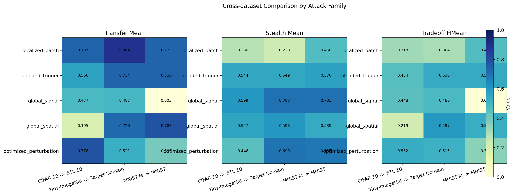

| dataset       | attack_family          |   n_points |   transfer_mean |   stealth_mean |   asr_mean |   tradeoff_hmean_mean |
|:--------------|:-----------------------|-----------:|----------------:|---------------:|-----------:|----------------------:|
| cifar10       | optimized_perturbation |         72 |          0.7776 |         0.4458 |     0.8441 |                0.5321 |
| cifar10       | blended_trigger        |        126 |          0.5659 |         0.5439 |     0.6267 |                0.4536 |
| cifar10       | global_signal          |         63 |          0.4772 |         0.599  |     0.6031 |                0.4484 |
| cifar10       | localized_patch        |        180 |          0.7371 |         0.2796 |     0.7991 |                0.3178 |
| cifar10       | global_spatial         |         72 |          0.1951 |         0.5575 |     0.6617 |                0.219  |
| mnistm        | blended_trigger        |        126 |          0.7358 |         0.5696 |     0.6545 |                0.5366 |
| mnistm        | global_spatial         |         72 |          0.7826 |         0.5388 |     0.57   |                0.5311 |
| mnistm        | localized_patch        |        180 |          0.7328 |         0.4684 |     0.6649 |                0.4635 |
| mnistm        | optimized_perturbation |         72 |          0.3928 |         0.6874 |     0.4032 |                0.3588 |
| mnistm        | global_signal          |         63 |          0.0026 |         0.7027 |     0.0279 |                0.0051 |
| tiny_imagenet | global_spatial         |         72 |          0.7251 |         0.5982 |     0.6212 |                0.5985 |
| tiny_imagenet | blended_trigger        |        123 |          0.6587 |         0.5491 |     0.6943 |                0.4975 |
| tiny_imagenet | optimized_perturbation |         48 |          0.3627 |         0.6989 |     0.4086 |                0.3751 |
| tiny_imagenet | global_signal          |         42 |          0.284  |         0.7026 |     0.4159 |                0.3074 |
| tiny_imagenet | localized_patch        |        180 |          0.827  |         0.2282 |     0.8276 |                0.2952 |

- 三个数据集都出现显著的迁移性-隐蔽性负相关，说明跨域后门的主矛盾始终是“强迁移”与“低暴露”之间的权衡。
- `Tiny-ImageNet -> Target Domain` 的平均迁移率最高，`MNIST-M -> MNIST` 的平均隐蔽性最高，但这种高隐蔽性并不总是正面信号。
- 从防御总体均值看，`CIFAR-10 -> STL-10` 上最强的是 `SCaLe-Up`，`Tiny-ImageNet` 与 `MNIST-M` 上最强的是 `IBD_PSC`。
- 从攻击家族看，`localized_patch` 往往迁移高但隐蔽差；`global_signal` 与 `optimized_perturbation` 更容易得到高隐蔽性，但常常是以牺牲迁移为代价。

## 5. 按攻击方法的跨数据集分析

- `SIG`：正弦/频域型全局触发。没有明确局部区域，通常更难被局部解释型防御抓到；但若域转换破坏其频率结构，迁移会显著下滑。 数值上看，cifar10: transfer=0.4772, stealth=0.5990, tradeoff=0.4484；tiny_imagenet: transfer=0.2840, stealth=0.7026, tradeoff=0.3074；mnistm: transfer=0.0026, stealth=0.7027, tradeoff=0.0051。它最需要谨慎解释，因为高隐蔽性很大一部分来自‘不容易被激活’而不是‘激活后仍不被检测’。尤其在 MNIST-M -> MNIST 上，平均迁移率只有 0.0026，已经接近整体失效。
- `WaNet`：几何形变触发。它不是加 patch，而是通过空间扭曲注入后门，往往对局部区域检测不敏感，且跨数据集表现高度依赖几何结构能否保留。 数值上看，cifar10: transfer=0.1951, stealth=0.5575, tradeoff=0.2190；tiny_imagenet: transfer=0.7251, stealth=0.5982, tradeoff=0.5985；mnistm: transfer=0.7826, stealth=0.5388, tradeoff=0.5311。它的跨数据集差异尤其大：CIFAR 上迁移明显偏低，但 Tiny 与 MNIST-M 上都进入高迁移高隐蔽区，说明几何形变触发是否稳定，强烈依赖源域与目标域的几何和纹理结构。
- `adaptive_blend`：自适应 blended trigger。与 blend 相比更强调 cover 与参数调节，目标是继续压低可见性。 数值上看，cifar10: transfer=0.4844, stealth=0.5735, tradeoff=0.4340；tiny_imagenet: transfer=0.6021, stealth=0.5614, tradeoff=0.4869；mnistm: transfer=0.6251, stealth=0.6374, tradeoff=0.5316。
- `adaptive_patch`：自适应局部 patch。仍然属于局部触发器，但参数与 cover 设计使其兼具 patch 强激活与一定伪装能力。 数值上看，cifar10: transfer=0.5439, stealth=0.4572, tradeoff=0.4275；tiny_imagenet: transfer=0.7773, stealth=0.2137, tradeoff=0.3164；mnistm: transfer=0.4828, stealth=0.5762, tradeoff=0.4910。
- `basic`：典型 BadNet/patch 攻击。触发器局部、显式、几何位置固定，通常最容易获得高 ASR 与高迁移，但也最容易暴露。 数值上看，cifar10: transfer=0.9093, stealth=0.1256, tradeoff=0.1736；tiny_imagenet: transfer=0.8147, stealth=0.1835, tradeoff=0.2213；mnistm: transfer=0.8626, stealth=0.3139, tradeoff=0.3691。它在三个数据集上都维持最高或接近最高的迁移率，但 `SentiNet` 在 CIFAR/Tiny/MNIST-M 上对它的平均 TPR 分别达到 0.9887/1.0000/0.9199，说明 patch 的高迁移几乎总是伴随高暴露。
- `belt`：局部区域 + mask/cover 的混合型触发。几何上仍偏局部，但显著性不如 basic/adaptive_patch 那样尖锐。 数值上看，cifar10: transfer=0.6398, stealth=0.3627, tradeoff=0.4426；tiny_imagenet: transfer=0.8867, stealth=0.3074, tradeoff=0.3885；mnistm: transfer=0.7466, stealth=0.6104, tradeoff=0.5822。
- `blend`：全局像素混合触发。触发器分布在整幅图像上，显著性扩散，通常比 patch 更隐蔽，但是否迁移取决于域间低层统计是否保留。 数值上看，cifar10: transfer=0.6475, stealth=0.5143, tradeoff=0.4732；tiny_imagenet: transfer=0.7125, stealth=0.5373, tradeoff=0.5076；mnistm: transfer=0.8466, stealth=0.5018, tradeoff=0.5417。
- `upgd`：优化型小扰动触发。更接近对抗式后门，依赖模型与数据分布的细粒度耦合，因此可能在近域迁移上表现很好，但在大域移位下快速失效。 数值上看，cifar10: transfer=0.7776, stealth=0.4458, tradeoff=0.5321；tiny_imagenet: transfer=0.3627, stealth=0.6989, tradeoff=0.3751；mnistm: transfer=0.3928, stealth=0.6874, tradeoff=0.3588。它在 CIFAR-10 -> STL-10 上反而是平均折中最好的方法，说明小扰动型后门在近域自然图像之间可能更容易保留。

## 6. CIFAR-10 -> STL-10

- Target setting: `train on CIFAR-10, test on STL-10`

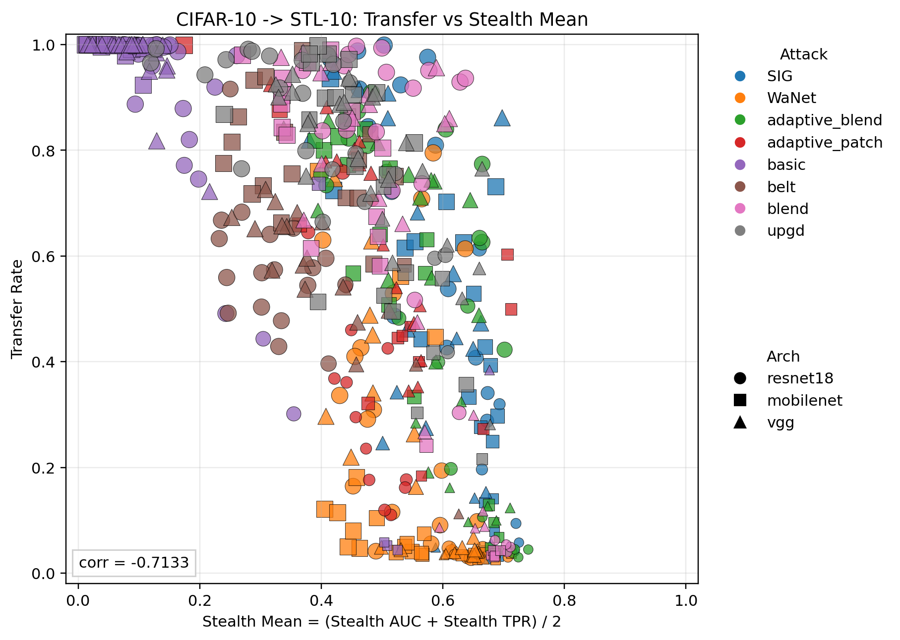

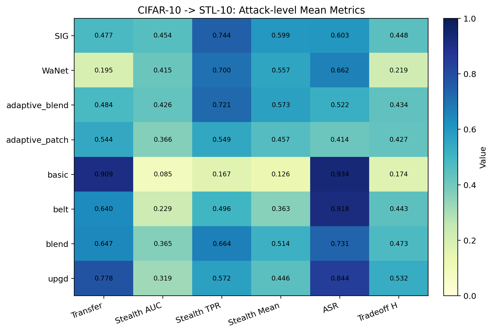

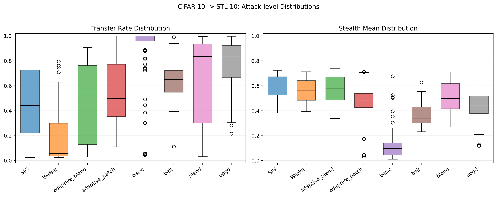

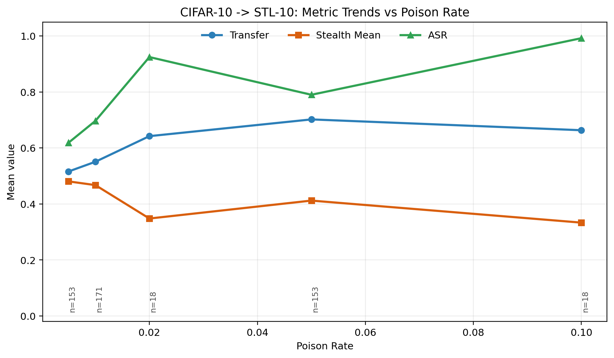

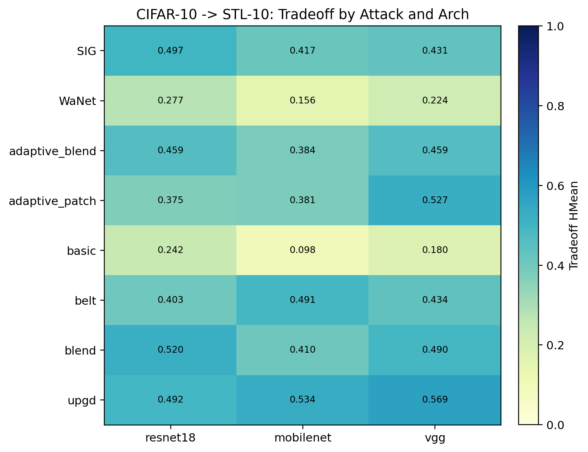

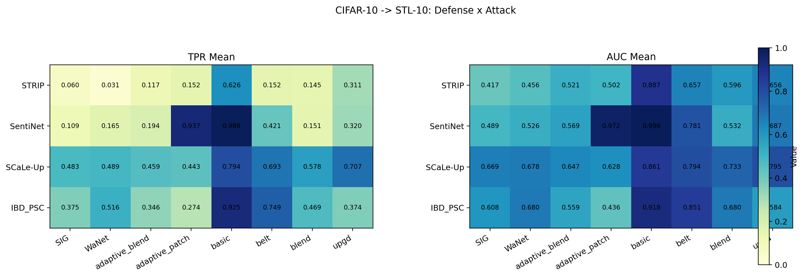

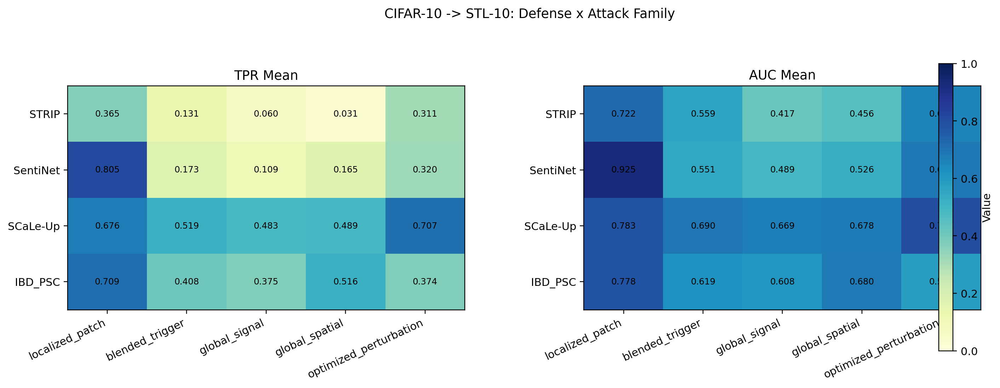

### 6.1 关键统计表

**攻击方法均值统计**

| attack_type    |   n_points |   transfer_mean |   stealth_mean_mean |   asr_mean |   tradeoff_hmean_mean |   rank_tradeoff_mean |
|:---------------|-----------:|----------------:|--------------------:|-----------:|----------------------:|---------------------:|
| upgd           |         72 |          0.7776 |              0.4458 |     0.8441 |                0.5321 |                    1 |
| blend          |         63 |          0.6475 |              0.5143 |     0.7309 |                0.4732 |                    2 |
| SIG            |         63 |          0.4772 |              0.599  |     0.6031 |                0.4484 |                    3 |
| belt           |         54 |          0.6398 |              0.3627 |     0.9179 |                0.4426 |                    4 |
| adaptive_blend |         63 |          0.4844 |              0.5735 |     0.5225 |                0.434  |                    5 |
| adaptive_patch |         45 |          0.5439 |              0.4572 |     0.4137 |                0.4275 |                    6 |
| WaNet          |         72 |          0.1951 |              0.5575 |     0.6617 |                0.219  |                    7 |
| basic          |         81 |          0.9093 |              0.1256 |     0.9339 |                0.1736 |                    8 |

**攻击家族均值统计**

| dataset   | attack_family          |   n_points |   transfer_mean |   stealth_mean |   asr_mean |   tradeoff_hmean_mean |
|:----------|:-----------------------|-----------:|----------------:|---------------:|-----------:|----------------------:|
| cifar10   | optimized_perturbation |         72 |          0.7776 |         0.4458 |     0.8441 |                0.5321 |
| cifar10   | blended_trigger        |        126 |          0.5659 |         0.5439 |     0.6267 |                0.4536 |
| cifar10   | global_signal          |         63 |          0.4772 |         0.599  |     0.6031 |                0.4484 |
| cifar10   | localized_patch        |        180 |          0.7371 |         0.2796 |     0.7991 |                0.3178 |
| cifar10   | global_spatial         |         72 |          0.1951 |         0.5575 |     0.6617 |                0.219  |

**防御方法总体统计**

| dataset   | defense   |   n_points |   tpr_mean |   auc_mean |   tpr_std |   auc_std |   stealth_from_tpr |   stealth_from_auc |
|:----------|:----------|-----------:|-----------:|-----------:|----------:|----------:|-------------------:|-------------------:|
| cifar10   | SCaLe-Up  |        513 |     0.5916 |     0.7329 |    0.2502 |    0.1434 |             0.4084 |             0.2671 |
| cifar10   | IBD_PSC   |        513 |     0.5199 |     0.677  |    0.3801 |    0.2364 |             0.4801 |             0.323  |
| cifar10   | SentiNet  |        513 |     0.4065 |     0.6902 |    0.3878 |    0.2236 |             0.5935 |             0.3098 |
| cifar10   | STRIP     |        513 |     0.2156 |     0.5977 |    0.2649 |    0.2086 |             0.7844 |             0.4023 |

**防御方法 x 攻击家族**

| dataset   | defense   | attack_family          |   n_points |   tpr_mean |   auc_mean |
|:----------|:----------|:-----------------------|-----------:|-----------:|-----------:|
| cifar10   | IBD_PSC   | localized_patch        |        180 |     0.7095 |     0.7776 |
| cifar10   | IBD_PSC   | global_spatial         |         72 |     0.5157 |     0.6802 |
| cifar10   | IBD_PSC   | blended_trigger        |        126 |     0.4077 |     0.6194 |
| cifar10   | IBD_PSC   | global_signal          |         63 |     0.3747 |     0.6075 |
| cifar10   | IBD_PSC   | optimized_perturbation |         72 |     0.3739 |     0.5843 |
| cifar10   | SCaLe-Up  | optimized_perturbation |         72 |     0.7066 |     0.7946 |
| cifar10   | SCaLe-Up  | localized_patch        |        180 |     0.6758 |     0.7827 |
| cifar10   | SCaLe-Up  | blended_trigger        |        126 |     0.5185 |     0.69   |
| cifar10   | SCaLe-Up  | global_spatial         |         72 |     0.4891 |     0.6781 |
| cifar10   | SCaLe-Up  | global_signal          |         63 |     0.4827 |     0.6688 |
| cifar10   | STRIP     | localized_patch        |        180 |     0.3653 |     0.7216 |
| cifar10   | STRIP     | optimized_perturbation |         72 |     0.3106 |     0.6563 |
| cifar10   | STRIP     | blended_trigger        |        126 |     0.1311 |     0.5586 |
| cifar10   | STRIP     | global_signal          |         63 |     0.0599 |     0.4171 |
| cifar10   | STRIP     | global_spatial         |         72 |     0.0306 |     0.4558 |
| cifar10   | SentiNet  | localized_patch        |        180 |     0.8054 |     0.9253 |
| cifar10   | SentiNet  | optimized_perturbation |         72 |     0.3204 |     0.6874 |
| cifar10   | SentiNet  | blended_trigger        |        126 |     0.1729 |     0.5506 |
| cifar10   | SentiNet  | global_spatial         |         72 |     0.1647 |     0.5261 |
| cifar10   | SentiNet  | global_signal          |         63 |     0.1085 |     0.4888 |

**防御方法 x 攻击方法**

| dataset   | defense   | attack_type    |   n_points |   tpr_mean |   auc_mean |   transfer_mean |
|:----------|:----------|:---------------|-----------:|-----------:|-----------:|----------------:|
| cifar10   | IBD_PSC   | basic          |         81 |     0.925  |     0.9183 |          0.9093 |
| cifar10   | IBD_PSC   | belt           |         54 |     0.7491 |     0.8513 |          0.6398 |
| cifar10   | IBD_PSC   | WaNet          |         72 |     0.5157 |     0.6802 |          0.1951 |
| cifar10   | IBD_PSC   | blend          |         63 |     0.4692 |     0.6799 |          0.6475 |
| cifar10   | IBD_PSC   | SIG            |         63 |     0.3747 |     0.6075 |          0.4772 |
| cifar10   | IBD_PSC   | upgd           |         72 |     0.3739 |     0.5843 |          0.7776 |
| cifar10   | IBD_PSC   | adaptive_blend |         63 |     0.3462 |     0.5588 |          0.4844 |
| cifar10   | IBD_PSC   | adaptive_patch |         45 |     0.2738 |     0.4357 |          0.5439 |
| cifar10   | SCaLe-Up  | basic          |         81 |     0.7936 |     0.861  |          0.9093 |
| cifar10   | SCaLe-Up  | upgd           |         72 |     0.7066 |     0.7946 |          0.7776 |
| cifar10   | SCaLe-Up  | belt           |         54 |     0.6929 |     0.7945 |          0.6398 |
| cifar10   | SCaLe-Up  | blend          |         63 |     0.5776 |     0.7334 |          0.6475 |
| cifar10   | SCaLe-Up  | WaNet          |         72 |     0.4891 |     0.6781 |          0.1951 |
| cifar10   | SCaLe-Up  | SIG            |         63 |     0.4827 |     0.6688 |          0.4772 |
| cifar10   | SCaLe-Up  | adaptive_blend |         63 |     0.4594 |     0.6466 |          0.4844 |
| cifar10   | SCaLe-Up  | adaptive_patch |         45 |     0.4431 |     0.6277 |          0.5439 |
| cifar10   | STRIP     | basic          |         81 |     0.6262 |     0.8866 |          0.9093 |
| cifar10   | STRIP     | upgd           |         72 |     0.3106 |     0.6563 |          0.7776 |
| cifar10   | STRIP     | belt           |         54 |     0.1518 |     0.6575 |          0.6398 |
| cifar10   | STRIP     | adaptive_patch |         45 |     0.1517 |     0.5017 |          0.5439 |
| cifar10   | STRIP     | blend          |         63 |     0.1454 |     0.5964 |          0.6475 |
| cifar10   | STRIP     | adaptive_blend |         63 |     0.1167 |     0.5209 |          0.4844 |
| cifar10   | STRIP     | SIG            |         63 |     0.0599 |     0.4171 |          0.4772 |
| cifar10   | STRIP     | WaNet          |         72 |     0.0306 |     0.4558 |          0.1951 |
| cifar10   | SentiNet  | basic          |         81 |     0.9887 |     0.9959 |          0.9093 |
| cifar10   | SentiNet  | adaptive_patch |         45 |     0.9371 |     0.9716 |          0.5439 |
| cifar10   | SentiNet  | belt           |         54 |     0.4206 |     0.7807 |          0.6398 |
| cifar10   | SentiNet  | upgd           |         72 |     0.3204 |     0.6874 |          0.7776 |
| cifar10   | SentiNet  | adaptive_blend |         63 |     0.1944 |     0.5691 |          0.4844 |
| cifar10   | SentiNet  | WaNet          |         72 |     0.1647 |     0.5261 |          0.1951 |
| cifar10   | SentiNet  | blend          |         63 |     0.1514 |     0.5322 |          0.6475 |
| cifar10   | SentiNet  | SIG            |         63 |     0.1085 |     0.4888 |          0.4772 |

**Poison Rate 趋势**

| dataset   |   poison_rate |   n_points |   transfer_mean |   transfer_median |   stealth_auc_mean |   stealth_tpr_mean |   stealth_mean_mean |   asr_mean |   tradeoff_hmean_mean |
|:----------|--------------:|-----------:|----------------:|------------------:|-------------------:|-------------------:|--------------------:|-----------:|----------------------:|
| cifar10   |         0.005 |        153 |          0.516  |            0.5577 |             0.3594 |             0.6022 |              0.4808 |     0.6185 |                0.3331 |
| cifar10   |         0.01  |        171 |          0.5509 |            0.5872 |             0.3432 |             0.5918 |              0.4675 |     0.6969 |                0.3756 |
| cifar10   |         0.02  |         18 |          0.6424 |            0.637  |             0.2286 |             0.4677 |              0.3481 |     0.925  |                0.4371 |
| cifar10   |         0.05  |        153 |          0.7022 |            0.8203 |             0.2987 |             0.5256 |              0.4122 |     0.7902 |                0.43   |
| cifar10   |         0.1   |         18 |          0.6635 |            0.6776 |             0.1948 |             0.4721 |              0.3334 |     0.9923 |                0.435  |

**Top-5 迁移-隐蔽折中配置**

|   rank_in_dataset | arch     | attack_type   |   poison_rate |   train_param_value | test_param_type   |   test_param_value |   transfer_rate |   stealth_mean |    asr |   tradeoff_hmean |
|------------------:|:---------|:--------------|--------------:|--------------------:|:------------------|-------------------:|----------------:|---------------:|-------:|-----------------:|
|                 1 | vgg      | SIG           |         0.01  |               56    | test_delta        |              56    |          0.8616 |         0.6975 | 0.973  |           0.7709 |
|                 2 | resnet18 | blend         |         0.005 |                0.3  | test_alpha        |               0.3  |          0.9363 |         0.6371 | 0.9933 |           0.7583 |
|                 3 | resnet18 | blend         |         0.005 |                0.25 | test_alpha        |               0.25 |          0.9292 |         0.6282 | 0.9864 |           0.7496 |
|                 4 | vgg      | blend         |         0.01  |                0.3  | test_alpha        |               0.3  |          0.9564 |         0.5894 | 0.9976 |           0.7293 |
|                 5 | resnet18 | SIG           |         0.01  |               44    | test_delta        |              44    |          0.9761 |         0.5749 | 0.9666 |           0.7236 |

### 6.2 详细分析

- 整体上，`CIFAR-10 -> STL-10` 的平均迁移率为 `0.5927`，平均隐蔽性为 `0.4461`，`transfer_rate` 与 `stealth_mean` 的相关系数为 `-0.7133`。
- 按攻击家族看，迁移率最高的是 `optimized_perturbation` (`transfer_mean=0.7776`)，隐蔽性最高的是 `global_signal` (`stealth_mean=0.5990`)，综合折中最好的是 `optimized_perturbation` (`tradeoff_hmean_mean=0.5321`)。
- 从防御端看，当前数据集上总体最强的检测方法是 `SCaLe-Up` (`TPR=0.5916`, `AUC=0.7329`)。
- 防御分化最大的攻击是 `adaptive_patch`：最佳防御为 `SentiNet` (`TPR=0.9371`)，最弱防御为 `STRIP` (`TPR=0.1517`)，两者差值达到 `0.7854`。
- 迁移率最不稳定的攻击是 `blend` (`transfer_std=0.3526`, `transfer_iqr=0.6354`)，说明该方法更依赖具体参数与架构组合。
- 这个数据集最鲜明的主线是：`basic` 与 `belt` 一类局部触发器迁移很强，但隐蔽性代价很高；`upgd` 与 `blend` 更接近折中解。结果上 `SCaLe-Up` 在 CIFAR 上总体最强，说明这里很多触发器在强度缩放后仍然能稳定主导预测。
- 另一个关键点是 `WaNet`：它在 CIFAR-10 -> STL-10 上平均迁移率只有 `0.1951`，远低于 Tiny 与 MNIST-M。这说明几何形变并不总能跨域保留，至少在 CIFAR 与 STL 的风格差异下，它比 patch/blend 更容易失稳。

- `upgd` 在这个数据集上之所以特别重要，不是因为它单项最好，而是因为它是少数同时把 `transfer_rate` 保持在高位、又没有像 `basic` 那样完全暴露的方法。从防御结果看，虽然 `SCaLe-Up` 对 `upgd` 的平均 TPR 仍达到 `0.7066`，但 `STRIP/SentiNet/IBD_PSC` 并没有像面对 patch 那样统一高效，因此它最终成为均值折中最优攻击。
- `adaptive_patch` 在 CIFAR 上出现了一个很典型的“局部自适应不等于局部不可检测”现象：`SentiNet` 的平均 TPR 达到 `0.9371`，说明只要触发仍以局部显著区域的形式存在，GradCAM 类方法仍然能稳定地把它抓出来。

## 7. Tiny-ImageNet -> Target Domain

- Target setting: `train on Tiny-ImageNet, test on later generated target-domain`

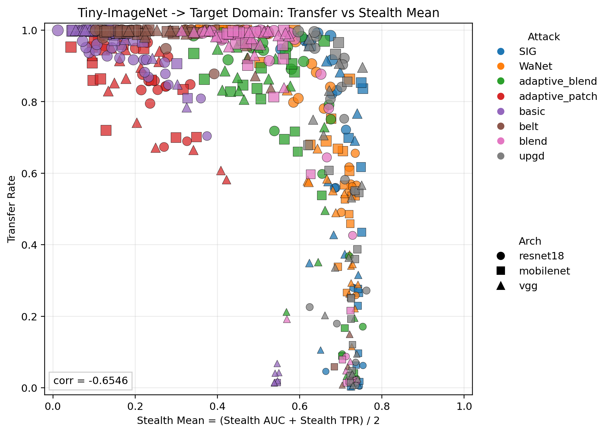

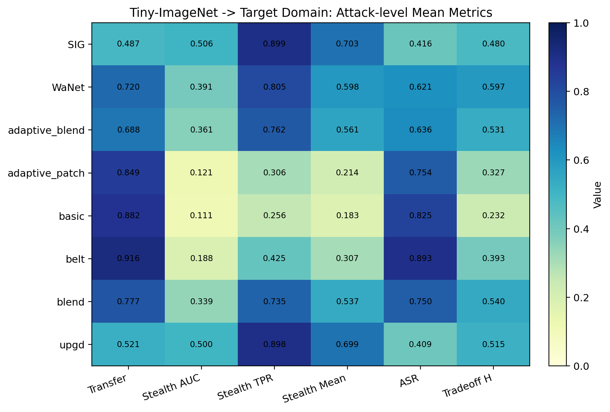

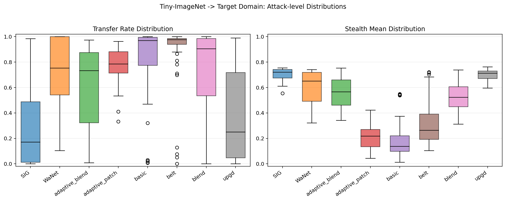

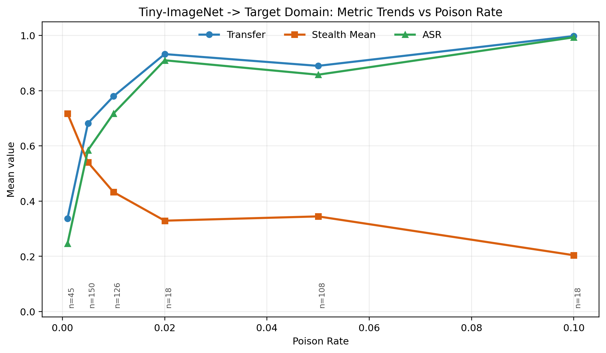

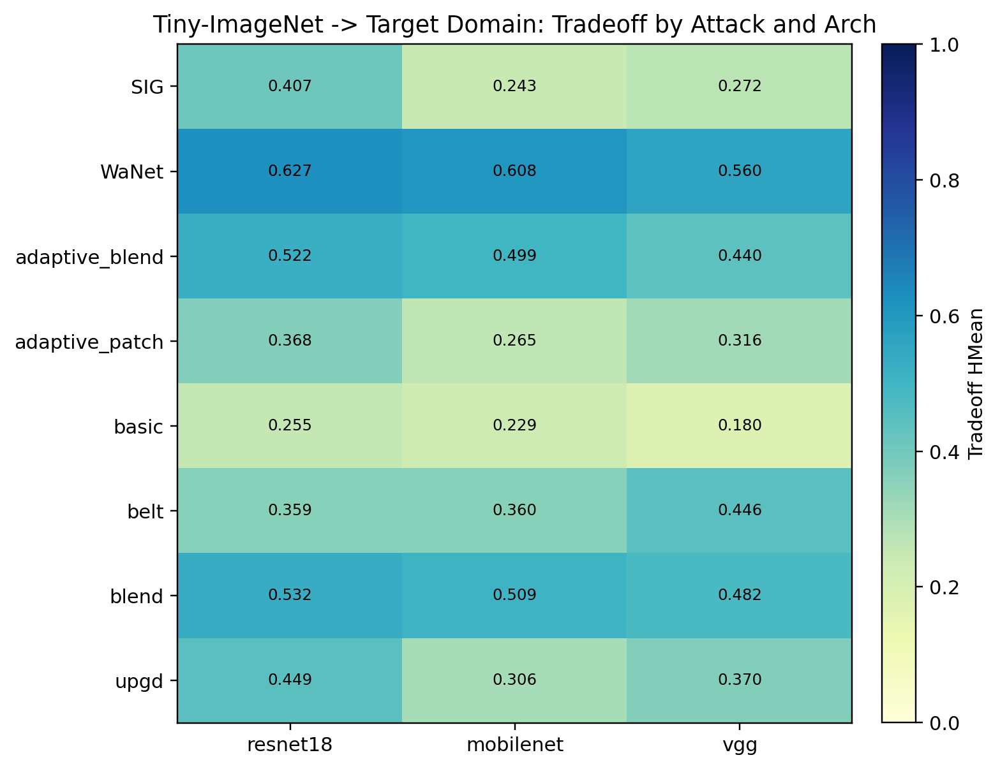

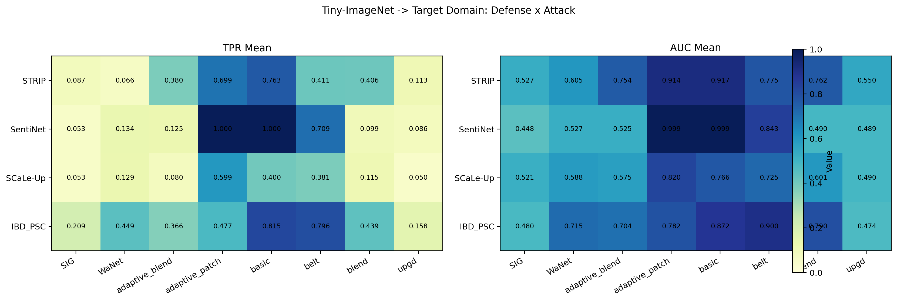

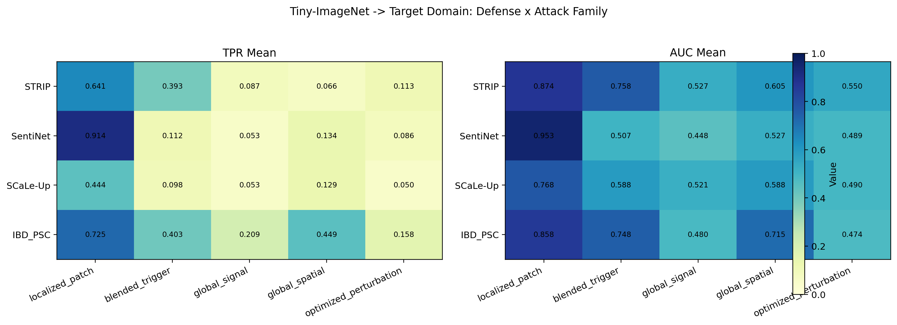

### 7.1 关键统计表

**攻击方法均值统计**

| attack_type    |   n_points |   transfer_mean |   stealth_mean_mean |   asr_mean |   tradeoff_hmean_mean |   rank_tradeoff_mean |
|:---------------|-----------:|----------------:|--------------------:|-----------:|----------------------:|---------------------:|
| WaNet          |         72 |          0.7251 |              0.5982 |     0.6212 |                0.5985 |                    1 |
| blend          |         63 |          0.7125 |              0.5373 |     0.7503 |                0.5076 |                    2 |
| adaptive_blend |         60 |          0.6021 |              0.5614 |     0.6355 |                0.4869 |                    3 |
| belt           |         54 |          0.8867 |              0.3074 |     0.8933 |                0.3885 |                    4 |
| upgd           |         48 |          0.3627 |              0.6989 |     0.4086 |                0.3751 |                    5 |
| adaptive_patch |         45 |          0.7773 |              0.2137 |     0.7542 |                0.3164 |                    6 |
| SIG            |         42 |          0.284  |              0.7026 |     0.4159 |                0.3074 |                    7 |
| basic          |         81 |          0.8147 |              0.1835 |     0.8247 |                0.2213 |                    8 |

**攻击家族均值统计**

| dataset       | attack_family          |   n_points |   transfer_mean |   stealth_mean |   asr_mean |   tradeoff_hmean_mean |
|:--------------|:-----------------------|-----------:|----------------:|---------------:|-----------:|----------------------:|
| tiny_imagenet | global_spatial         |         72 |          0.7251 |         0.5982 |     0.6212 |                0.5985 |
| tiny_imagenet | blended_trigger        |        123 |          0.6587 |         0.5491 |     0.6943 |                0.4975 |
| tiny_imagenet | optimized_perturbation |         48 |          0.3627 |         0.6989 |     0.4086 |                0.3751 |
| tiny_imagenet | global_signal          |         42 |          0.284  |         0.7026 |     0.4159 |                0.3074 |
| tiny_imagenet | localized_patch        |        180 |          0.827  |         0.2282 |     0.8276 |                0.2952 |

**防御方法总体统计**

| dataset       | defense   |   n_points |   tpr_mean |   auc_mean |   tpr_std |   auc_std |   stealth_from_tpr |   stealth_from_auc |
|:--------------|:----------|-----------:|-----------:|-----------:|----------:|----------:|-------------------:|-------------------:|
| tiny_imagenet | IBD_PSC   |        465 |     0.492  |     0.7331 |    0.3891 |    0.2161 |             0.508  |             0.2669 |
| tiny_imagenet | SentiNet  |        464 |     0.4166 |     0.6749 |    0.4312 |    0.2425 |             0.5834 |             0.3251 |
| tiny_imagenet | STRIP     |        465 |     0.3822 |     0.7368 |    0.3364 |    0.1881 |             0.6178 |             0.2632 |
| tiny_imagenet | SCaLe-Up  |        465 |     0.2275 |     0.6414 |    0.2554 |    0.1512 |             0.7725 |             0.3586 |

**防御方法 x 攻击家族**

| dataset       | defense   | attack_family          |   n_points |   tpr_mean |   auc_mean |
|:--------------|:----------|:-----------------------|-----------:|-----------:|-----------:|
| tiny_imagenet | IBD_PSC   | localized_patch        |        180 |     0.7248 |     0.8582 |
| tiny_imagenet | IBD_PSC   | global_spatial         |         72 |     0.4491 |     0.7155 |
| tiny_imagenet | IBD_PSC   | blended_trigger        |        123 |     0.4035 |     0.7477 |
| tiny_imagenet | IBD_PSC   | global_signal          |         42 |     0.2087 |     0.4805 |
| tiny_imagenet | IBD_PSC   | optimized_perturbation |         48 |     0.1582 |     0.4738 |
| tiny_imagenet | SCaLe-Up  | localized_patch        |        180 |     0.4438 |     0.7675 |
| tiny_imagenet | SCaLe-Up  | global_spatial         |         72 |     0.129  |     0.5883 |
| tiny_imagenet | SCaLe-Up  | blended_trigger        |        123 |     0.0977 |     0.5883 |
| tiny_imagenet | SCaLe-Up  | global_signal          |         42 |     0.0532 |     0.5208 |
| tiny_imagenet | SCaLe-Up  | optimized_perturbation |         48 |     0.0497 |     0.4896 |
| tiny_imagenet | STRIP     | localized_patch        |        180 |     0.6414 |     0.8736 |
| tiny_imagenet | STRIP     | blended_trigger        |        123 |     0.3933 |     0.7582 |
| tiny_imagenet | STRIP     | optimized_perturbation |         48 |     0.1131 |     0.55   |
| tiny_imagenet | STRIP     | global_signal          |         42 |     0.0872 |     0.5274 |
| tiny_imagenet | STRIP     | global_spatial         |         72 |     0.0664 |     0.605  |
| tiny_imagenet | SentiNet  | localized_patch        |        179 |     0.9137 |     0.9529 |
| tiny_imagenet | SentiNet  | global_spatial         |         72 |     0.1339 |     0.527  |
| tiny_imagenet | SentiNet  | blended_trigger        |        123 |     0.1118 |     0.5068 |
| tiny_imagenet | SentiNet  | optimized_perturbation |         48 |     0.0857 |     0.4887 |
| tiny_imagenet | SentiNet  | global_signal          |         42 |     0.0535 |     0.4483 |

**防御方法 x 攻击方法**

| dataset       | defense   | attack_type    |   n_points |   tpr_mean |   auc_mean |   transfer_mean |
|:--------------|:----------|:---------------|-----------:|-----------:|-----------:|----------------:|
| tiny_imagenet | IBD_PSC   | basic          |         81 |     0.8149 |     0.8721 |          0.8147 |
| tiny_imagenet | IBD_PSC   | belt           |         54 |     0.7962 |     0.9005 |          0.8867 |
| tiny_imagenet | IBD_PSC   | adaptive_patch |         45 |     0.477  |     0.7824 |          0.7773 |
| tiny_imagenet | IBD_PSC   | WaNet          |         72 |     0.4491 |     0.7155 |          0.7251 |
| tiny_imagenet | IBD_PSC   | blend          |         63 |     0.439  |     0.7896 |          0.7125 |
| tiny_imagenet | IBD_PSC   | adaptive_blend |         60 |     0.3662 |     0.7036 |          0.6021 |
| tiny_imagenet | IBD_PSC   | SIG            |         42 |     0.2087 |     0.4805 |          0.284  |
| tiny_imagenet | IBD_PSC   | upgd           |         48 |     0.1582 |     0.4738 |          0.3627 |
| tiny_imagenet | SCaLe-Up  | adaptive_patch |         45 |     0.5985 |     0.8204 |          0.7773 |
| tiny_imagenet | SCaLe-Up  | basic          |         81 |     0.3996 |     0.7665 |          0.8147 |
| tiny_imagenet | SCaLe-Up  | belt           |         54 |     0.3812 |     0.725  |          0.8867 |
| tiny_imagenet | SCaLe-Up  | WaNet          |         72 |     0.129  |     0.5883 |          0.7251 |
| tiny_imagenet | SCaLe-Up  | blend          |         63 |     0.1149 |     0.6013 |          0.7125 |
| tiny_imagenet | SCaLe-Up  | adaptive_blend |         60 |     0.0796 |     0.5747 |          0.6021 |
| tiny_imagenet | SCaLe-Up  | SIG            |         42 |     0.0532 |     0.5208 |          0.284  |
| tiny_imagenet | SCaLe-Up  | upgd           |         48 |     0.0497 |     0.4896 |          0.3627 |
| tiny_imagenet | STRIP     | basic          |         81 |     0.7633 |     0.9166 |          0.8147 |
| tiny_imagenet | STRIP     | adaptive_patch |         45 |     0.6987 |     0.9143 |          0.7773 |
| tiny_imagenet | STRIP     | belt           |         54 |     0.4109 |     0.7751 |          0.8867 |
| tiny_imagenet | STRIP     | blend          |         63 |     0.4063 |     0.7618 |          0.7125 |
| tiny_imagenet | STRIP     | adaptive_blend |         60 |     0.3797 |     0.7545 |          0.6021 |
| tiny_imagenet | STRIP     | upgd           |         48 |     0.1131 |     0.55   |          0.3627 |
| tiny_imagenet | STRIP     | SIG            |         42 |     0.0872 |     0.5274 |          0.284  |
| tiny_imagenet | STRIP     | WaNet          |         72 |     0.0664 |     0.605  |          0.7251 |
| tiny_imagenet | SentiNet  | adaptive_patch |         45 |     1      |     0.9991 |          0.7773 |
| tiny_imagenet | SentiNet  | basic          |         81 |     1      |     0.999  |          0.8147 |
| tiny_imagenet | SentiNet  | belt           |         53 |     0.7086 |     0.8434 |          0.8854 |
| tiny_imagenet | SentiNet  | WaNet          |         72 |     0.1339 |     0.527  |          0.7251 |
| tiny_imagenet | SentiNet  | adaptive_blend |         60 |     0.1253 |     0.525  |          0.6021 |
| tiny_imagenet | SentiNet  | blend          |         63 |     0.0989 |     0.4895 |          0.7125 |
| tiny_imagenet | SentiNet  | upgd           |         48 |     0.0857 |     0.4887 |          0.3627 |
| tiny_imagenet | SentiNet  | SIG            |         42 |     0.0535 |     0.4483 |          0.284  |

**Poison Rate 趋势**

| dataset       |   poison_rate |   n_points |   transfer_mean |   transfer_median |   stealth_auc_mean |   stealth_tpr_mean |   stealth_mean_mean |   asr_mean |   tradeoff_hmean_mean |
|:--------------|--------------:|-----------:|----------------:|------------------:|-------------------:|-------------------:|--------------------:|-----------:|----------------------:|
| tiny_imagenet |         0.001 |         45 |          0.1551 |            0.0543 |             0.5254 |             0.9094 |              0.7174 |     0.2462 |                0.2013 |
| tiny_imagenet |         0.005 |        150 |          0.5817 |            0.6256 |             0.3654 |             0.7155 |              0.5405 |     0.5849 |                0.4303 |
| tiny_imagenet |         0.01  |        126 |          0.7253 |            0.8377 |             0.2769 |             0.5886 |              0.4327 |     0.7176 |                0.4297 |
| tiny_imagenet |         0.02  |         18 |          0.9031 |            0.9714 |             0.2051 |             0.4533 |              0.3292 |     0.9104 |                0.4283 |
| tiny_imagenet |         0.05  |        108 |          0.8521 |            0.9839 |             0.2031 |             0.4864 |              0.3447 |     0.8581 |                0.4339 |
| tiny_imagenet |         0.1   |         18 |          0.9724 |            0.9809 |             0.1169 |             0.2955 |              0.2062 |     0.9938 |                0.3348 |

**Top-5 迁移-隐蔽折中配置**

|   rank_in_dataset | arch      | attack_type    |   poison_rate |   train_param_value | test_param_type   |   test_param_value |   transfer_rate |   stealth_mean |    asr |   tradeoff_hmean |
|------------------:|:----------|:---------------|--------------:|--------------------:|:------------------|-------------------:|----------------:|---------------:|-------:|-----------------:|
|                 1 | mobilenet | upgd           |         0.005 |                20   | test_eps          |               20   |          0.9286 |         0.6941 | 0.823  |           0.7944 |
|                 2 | mobilenet | WaNet          |         0.01  |                 0.8 | test_s            |                0.8 |          0.8693 |         0.7208 | 0.8206 |           0.7881 |
|                 3 | mobilenet | adaptive_blend |         0.005 |                 0.3 | test_alpha        |                0.3 |          0.9578 |         0.6591 | 0.9602 |           0.7808 |
|                 4 | resnet18  | SIG            |         0.005 |                56   | test_delta        |               56   |          0.9839 |         0.6435 | 0.9838 |           0.7781 |
|                 5 | resnet18  | upgd           |         0.005 |                24   | test_eps          |               24   |          0.9899 |         0.6355 | 0.9781 |           0.7741 |

### 7.2 详细分析

- 整体上，`Tiny-ImageNet -> Target Domain` 的平均迁移率为 `0.6697`，平均隐蔽性为 `0.4618`，`transfer_rate` 与 `stealth_mean` 的相关系数为 `-0.6862`。
- 按攻击家族看，迁移率最高的是 `localized_patch` (`transfer_mean=0.8270`)，隐蔽性最高的是 `global_signal` (`stealth_mean=0.7026`)，综合折中最好的是 `global_spatial` (`tradeoff_hmean_mean=0.5985`)。
- 从防御端看，当前数据集上总体最强的检测方法是 `IBD_PSC` (`TPR=0.4920`, `AUC=0.7331`)。
- 防御分化最大的攻击是 `basic`：最佳防御为 `SentiNet` (`TPR=1.0000`)，最弱防御为 `SCaLe-Up` (`TPR=0.3996`)，两者差值达到 `0.6004`。
- 迁移率最不稳定的攻击是 `blend` (`transfer_std=0.3696`, `transfer_iqr=0.4497`)，说明该方法更依赖具体参数与架构组合。
- Tiny-ImageNet 的 target-domain 结果最值得强调的现象是：`WaNet` 成为综合折中最优方法，而不是传统 patch。这意味着你后生成的 target-domain 并没有破坏形变型后门，反而让它在高迁移和高隐蔽之间形成了更好的平衡。
- 同时，`adaptive_patch` 在这里虽然平均迁移率很高，但 `SentiNet` 与 `STRIP` 分别达到 `1.0000` / `0.6987`，说明它的高迁移并没有换来真正的检测逃逸。

- `STRIP` 在 Tiny 上对 `blend/adaptive_blend` 的平均 TPR 分别达到 `0.4063` / `0.3797`，比在 CIFAR 或 MNIST-M 上都更高。这是一个值得写进论文的反常点：虽然 blended trigger 按机理不是典型局部触发器，但在 64x64 自然图像及当前 target-domain 下，输入混合仍然足以打破其低熵主导性。
- `IBD_PSC` 在 Tiny 上几乎对所有非极弱攻击都保持中等以上检测能力，尤其是 `belt/basic/WaNet/blend`。这意味着 target-domain 迁移并没有抹去模型内部的后门一致性，哪怕有些攻击在像素层面并不显眼，模型内部响应仍可被参数缩放方法放大。

## 8. MNIST-M -> MNIST

- Target setting: `train on MNIST-M, test on MNIST`

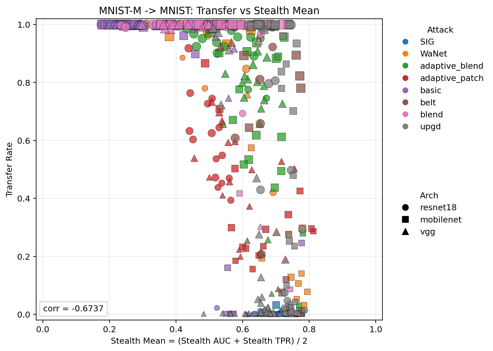

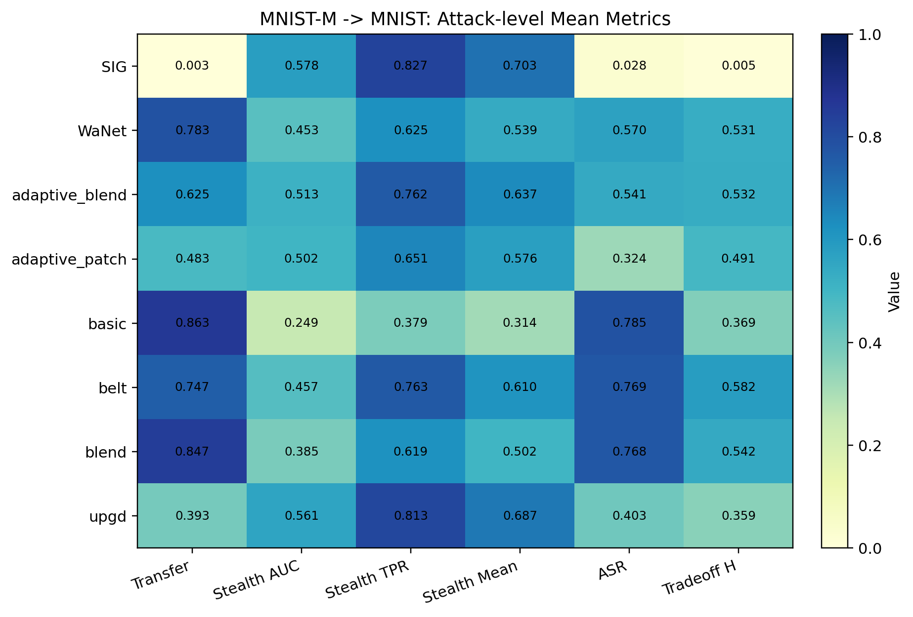

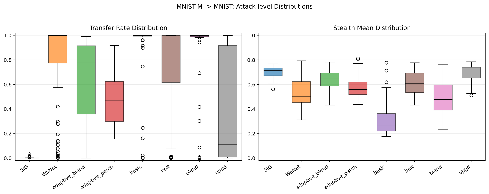

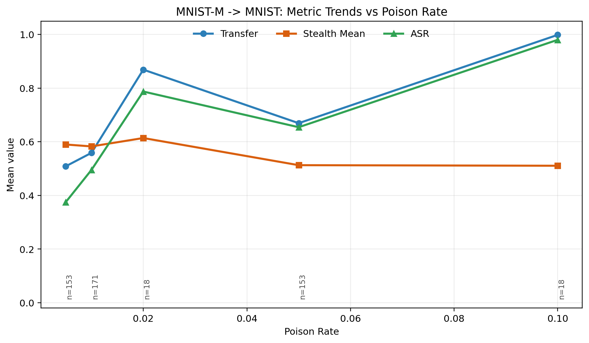

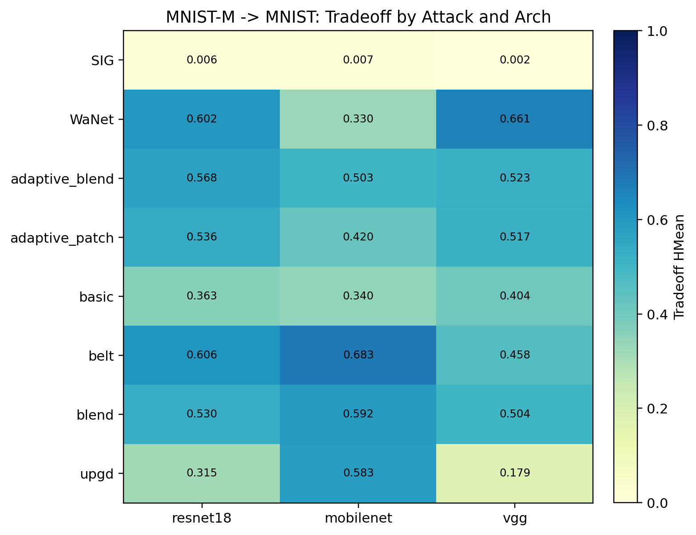

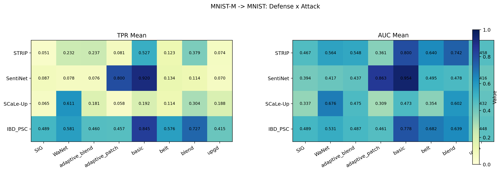

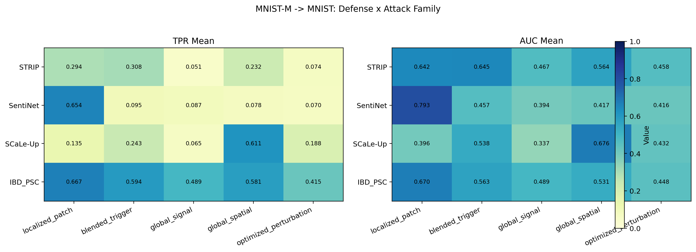

### 8.1 关键统计表

**攻击方法均值统计**

| attack_type    |   n_points |   transfer_mean |   stealth_mean_mean |   asr_mean |   tradeoff_hmean_mean |   rank_tradeoff_mean |
|:---------------|-----------:|----------------:|--------------------:|-----------:|----------------------:|---------------------:|
| belt           |         54 |          0.7466 |              0.6104 |     0.7695 |                0.5822 |                    1 |
| blend          |         63 |          0.8466 |              0.5018 |     0.7678 |                0.5417 |                    2 |
| adaptive_blend |         63 |          0.6251 |              0.6374 |     0.5412 |                0.5316 |                    3 |
| WaNet          |         72 |          0.7826 |              0.5388 |     0.57   |                0.5311 |                    4 |
| adaptive_patch |         45 |          0.4828 |              0.5762 |     0.3236 |                0.491  |                    5 |
| basic          |         81 |          0.8626 |              0.3139 |     0.7847 |                0.3691 |                    6 |
| upgd           |         72 |          0.3928 |              0.6874 |     0.4032 |                0.3588 |                    7 |
| SIG            |         63 |          0.0026 |              0.7027 |     0.0279 |                0.0051 |                    8 |

**攻击家族均值统计**

| dataset   | attack_family          |   n_points |   transfer_mean |   stealth_mean |   asr_mean |   tradeoff_hmean_mean |
|:----------|:-----------------------|-----------:|----------------:|---------------:|-----------:|----------------------:|
| mnistm    | blended_trigger        |        126 |          0.7358 |         0.5696 |     0.6545 |                0.5366 |
| mnistm    | global_spatial         |         72 |          0.7826 |         0.5388 |     0.57   |                0.5311 |
| mnistm    | localized_patch        |        180 |          0.7328 |         0.4684 |     0.6649 |                0.4635 |
| mnistm    | optimized_perturbation |         72 |          0.3928 |         0.6874 |     0.4032 |                0.3588 |
| mnistm    | global_signal          |         63 |          0.0026 |         0.7027 |     0.0279 |                0.0051 |

**防御方法总体统计**

| dataset   | defense   |   n_points |   tpr_mean |   auc_mean |   tpr_std |   auc_std |   stealth_from_tpr |   stealth_from_auc |
|:----------|:----------|-----------:|-----------:|-----------:|----------:|----------:|-------------------:|-------------------:|
| mnistm    | IBD_PSC   |        513 |     0.5796 |     0.571  |    0.3123 |    0.1974 |             0.4204 |             0.429  |
| mnistm    | SentiNet  |        513 |     0.2843 |     0.556  |    0.3771 |    0.2398 |             0.7157 |             0.444  |
| mnistm    | STRIP     |        513 |     0.2279 |     0.5847 |    0.2807 |    0.2045 |             0.7721 |             0.4153 |
| mnistm    | SCaLe-Up  |        513 |     0.227  |     0.4682 |    0.2587 |    0.1757 |             0.773  |             0.5318 |

**防御方法 x 攻击家族**

| dataset   | defense   | attack_family          |   n_points |   tpr_mean |   auc_mean |
|:----------|:----------|:-----------------------|-----------:|-----------:|-----------:|
| mnistm    | IBD_PSC   | localized_patch        |        180 |     0.667  |     0.67   |
| mnistm    | IBD_PSC   | blended_trigger        |        126 |     0.5936 |     0.5631 |
| mnistm    | IBD_PSC   | global_spatial         |         72 |     0.5805 |     0.5313 |
| mnistm    | IBD_PSC   | global_signal          |         63 |     0.4885 |     0.4895 |
| mnistm    | IBD_PSC   | optimized_perturbation |         72 |     0.415  |     0.4481 |
| mnistm    | SCaLe-Up  | global_spatial         |         72 |     0.6111 |     0.6756 |
| mnistm    | SCaLe-Up  | blended_trigger        |        126 |     0.2425 |     0.5384 |
| mnistm    | SCaLe-Up  | optimized_perturbation |         72 |     0.1876 |     0.4325 |
| mnistm    | SCaLe-Up  | localized_patch        |        180 |     0.1349 |     0.3964 |
| mnistm    | SCaLe-Up  | global_signal          |         63 |     0.0647 |     0.3369 |
| mnistm    | STRIP     | blended_trigger        |        126 |     0.3077 |     0.6451 |
| mnistm    | STRIP     | localized_patch        |        180 |     0.2943 |     0.6423 |
| mnistm    | STRIP     | global_spatial         |         72 |     0.2319 |     0.5641 |
| mnistm    | STRIP     | optimized_perturbation |         72 |     0.0735 |     0.458  |
| mnistm    | STRIP     | global_signal          |         63 |     0.0506 |     0.4674 |
| mnistm    | SentiNet  | localized_patch        |        180 |     0.6542 |     0.7934 |
| mnistm    | SentiNet  | blended_trigger        |        126 |     0.0952 |     0.4574 |
| mnistm    | SentiNet  | global_signal          |         63 |     0.0868 |     0.3936 |
| mnistm    | SentiNet  | global_spatial         |         72 |     0.0777 |     0.417  |
| mnistm    | SentiNet  | optimized_perturbation |         72 |     0.07   |     0.4158 |

**防御方法 x 攻击方法**

| dataset   | defense   | attack_type    |   n_points |   tpr_mean |   auc_mean |   transfer_mean |
|:----------|:----------|:---------------|-----------:|-----------:|-----------:|----------------:|
| mnistm    | IBD_PSC   | basic          |         81 |     0.8447 |     0.7781 |          0.8626 |
| mnistm    | IBD_PSC   | blend          |         63 |     0.7268 |     0.6391 |          0.8466 |
| mnistm    | IBD_PSC   | WaNet          |         72 |     0.5805 |     0.5313 |          0.7826 |
| mnistm    | IBD_PSC   | belt           |         54 |     0.5756 |     0.6819 |          0.7466 |
| mnistm    | IBD_PSC   | SIG            |         63 |     0.4885 |     0.4895 |          0.0026 |
| mnistm    | IBD_PSC   | adaptive_blend |         63 |     0.4604 |     0.4872 |          0.6251 |
| mnistm    | IBD_PSC   | adaptive_patch |         45 |     0.4569 |     0.4609 |          0.4828 |
| mnistm    | IBD_PSC   | upgd           |         72 |     0.415  |     0.4481 |          0.3928 |
| mnistm    | SCaLe-Up  | WaNet          |         72 |     0.6111 |     0.6756 |          0.7826 |
| mnistm    | SCaLe-Up  | blend          |         63 |     0.3041 |     0.6018 |          0.8466 |
| mnistm    | SCaLe-Up  | basic          |         81 |     0.1915 |     0.4732 |          0.8626 |
| mnistm    | SCaLe-Up  | upgd           |         72 |     0.1876 |     0.4325 |          0.3928 |
| mnistm    | SCaLe-Up  | adaptive_blend |         63 |     0.1809 |     0.475  |          0.6251 |
| mnistm    | SCaLe-Up  | belt           |         54 |     0.1139 |     0.3538 |          0.7466 |
| mnistm    | SCaLe-Up  | SIG            |         63 |     0.0647 |     0.3369 |          0.0026 |
| mnistm    | SCaLe-Up  | adaptive_patch |         45 |     0.0584 |     0.3093 |          0.4828 |
| mnistm    | STRIP     | basic          |         81 |     0.5272 |     0.8001 |          0.8626 |
| mnistm    | STRIP     | blend          |         63 |     0.3789 |     0.7424 |          0.8466 |
| mnistm    | STRIP     | adaptive_blend |         63 |     0.2365 |     0.5477 |          0.6251 |
| mnistm    | STRIP     | WaNet          |         72 |     0.2319 |     0.5641 |          0.7826 |
| mnistm    | STRIP     | belt           |         54 |     0.123  |     0.6399 |          0.7466 |
| mnistm    | STRIP     | adaptive_patch |         45 |     0.0808 |     0.3611 |          0.4828 |
| mnistm    | STRIP     | upgd           |         72 |     0.0735 |     0.458  |          0.3928 |
| mnistm    | STRIP     | SIG            |         63 |     0.0506 |     0.4674 |          0.0026 |
| mnistm    | SentiNet  | basic          |         81 |     0.9199 |     0.9541 |          0.8626 |
| mnistm    | SentiNet  | adaptive_patch |         45 |     0.8004 |     0.8625 |          0.4828 |
| mnistm    | SentiNet  | belt           |         54 |     0.134  |     0.4947 |          0.7466 |
| mnistm    | SentiNet  | blend          |         63 |     0.1145 |     0.4778 |          0.8466 |
| mnistm    | SentiNet  | SIG            |         63 |     0.0868 |     0.3936 |          0.0026 |
| mnistm    | SentiNet  | WaNet          |         72 |     0.0777 |     0.417  |          0.7826 |
| mnistm    | SentiNet  | adaptive_blend |         63 |     0.0759 |     0.437  |          0.6251 |
| mnistm    | SentiNet  | upgd           |         72 |     0.07   |     0.4158 |          0.3928 |

**Poison Rate 趋势**

| dataset   |   poison_rate |   n_points |   transfer_mean |   transfer_median |   stealth_auc_mean |   stealth_tpr_mean |   stealth_mean_mean |   asr_mean |   tradeoff_hmean_mean |
|:----------|--------------:|-----------:|----------------:|------------------:|-------------------:|-------------------:|--------------------:|-----------:|----------------------:|
| mnistm    |         0.005 |        153 |          0.5085 |            0.4527 |             0.4809 |             0.6991 |              0.59   |     0.3745 |                0.3744 |
| mnistm    |         0.01  |        171 |          0.5589 |            0.7098 |             0.4679 |             0.6978 |              0.5829 |     0.4955 |                0.4003 |
| mnistm    |         0.02  |         18 |          0.8691 |            0.9956 |             0.4588 |             0.7694 |              0.6141 |     0.7875 |                0.6867 |
| mnistm    |         0.05  |        153 |          0.6694 |            0.9612 |             0.4231 |             0.6026 |              0.5129 |     0.6544 |                0.4262 |
| mnistm    |         0.1   |         18 |          0.9987 |            1      |             0.3808 |             0.6407 |              0.5107 |     0.9803 |                0.6747 |

**Top-5 迁移-隐蔽折中配置**

|   rank_in_dataset | arch      | attack_type   |   poison_rate |   train_param_value | test_param_type   |   test_param_value |   transfer_rate |   stealth_mean |    asr |   tradeoff_hmean |
|------------------:|:----------|:--------------|--------------:|--------------------:|:------------------|-------------------:|----------------:|---------------:|-------:|-----------------:|
|                 1 | resnet18  | upgd          |         0.05  |                20   | test_eps          |               20   |          0.9985 |         0.7458 | 0.889  |           0.8539 |
|                 2 | mobilenet | upgd          |         0.005 |                20   | test_eps          |               20   |          0.9999 |         0.7402 | 0.657  |           0.8506 |
|                 3 | mobilenet | belt          |         0.02  |                 0.2 | test_mask_rate    |                0.2 |          1      |         0.7358 | 0.9828 |           0.8478 |
|                 4 | mobilenet | upgd          |         0.05  |                12   | test_eps          |               12   |          0.9347 |         0.7621 | 0.4672 |           0.8396 |
|                 5 | mobilenet | blend         |         0.01  |                 0.3 | test_alpha        |                0.3 |          1      |         0.7202 | 0.983  |           0.8374 |

### 8.2 详细分析

- 整体上，`MNIST-M -> MNIST` 的平均迁移率为 `0.6031`，平均隐蔽性为 `0.5627`，`transfer_rate` 与 `stealth_mean` 的相关系数为 `-0.6737`。
- 按攻击家族看，迁移率最高的是 `global_spatial` (`transfer_mean=0.7826`)，隐蔽性最高的是 `global_signal` (`stealth_mean=0.7027`)，综合折中最好的是 `blended_trigger` (`tradeoff_hmean_mean=0.5366`)。
- 从防御端看，当前数据集上总体最强的检测方法是 `IBD_PSC` (`TPR=0.5796`, `AUC=0.5710`)。
- 防御分化最大的攻击是 `adaptive_patch`：最佳防御为 `SentiNet` (`TPR=0.8004`)，最弱防御为 `SCaLe-Up` (`TPR=0.0584`)，两者差值达到 `0.7420`。
- 迁移率最不稳定的攻击是 `upgd` (`transfer_std=0.4282`, `transfer_iqr=0.9090`)，说明该方法更依赖具体参数与架构组合。
- MNIST-M 最关键的异常是 `SIG`：它的平均迁移率只有 `0.0026`，平均 ASR 只有 `0.0279`，而且此前稳定性统计也显示它不是个别参数点失效，而是整个参数空间都接近失效。因此这里的‘高隐蔽性’不能被写成成功逃逸检测，更准确的说法是它在目标域根本不容易被触发。
- 另一个值得深挖的点是 `SCaLe-Up` 对 `WaNet` 的平均 TPR 达到 `0.6111`，反而远高于它对 basic/belt/adaptive_patch 的检测效果。结合方法机制，更合理的解释是：在 MNIST 风格的简单结构上，形变型触发在强度缩放下更容易保留异常一致性，因此会被 SCaLe-Up 放大。

- `SentiNet` 在 MNIST-M 上对 `belt` 的平均 TPR 只有 `0.1340`，明显低于它对 `basic` (`0.9199`) 和 `adaptive_patch` (`0.8004`) 的检测能力。这说明 `belt` 虽然仍是局部触发器，但它的 mask/cover 设计让触发区域不再总是成为最显著的 GradCAM 区域。
- `IBD_PSC` 在 MNIST-M 上是最稳健的总体防御：它不只对 `basic/blend/WaNet` 有效，对几乎已经失效的 `SIG` 也给出了相对更高的 TPR (`0.4885`)。这说明它捕捉到的不只是像素可见性，而是后门输入在模型内部的一致性偏移。

## 9. 按防御方法的综合分析

- `STRIP`：输入混合熵检测。代码中通过把测试样本与多张干净样本叠加后计算预测熵来区分 clean/poison；如果触发器在混合后仍能稳定主导模型，熵会偏低，因此更适合抓强主导型 patch 或部分 blend。 总体均值为 cifar10: TPR=0.2156, AUC=0.5977；tiny_imagenet: TPR=0.3822, AUC=0.7368；mnistm: TPR=0.2279, AUC=0.5847。 从攻击家族看，它对 `localized_patch/global_signal/global_spatial` 的平均 TPR 约为 0.4337/0.0659/0.1096。
- `SentiNet`：GradCAM 驱动的局部解释型检测。`other_defenses_tool_box/sentinet.py` 明确写有 `Only support localized attacks`，并使用显著区域替换/移植策略，因此天然偏向局部触发器。 总体均值为 cifar10: TPR=0.4065, AUC=0.6902；tiny_imagenet: TPR=0.4166, AUC=0.6749；mnistm: TPR=0.2843, AUC=0.5560。 从攻击家族看，它对 `localized_patch/global_signal/global_spatial` 的平均 TPR 约为 0.7911/0.0829/0.1254。
- `SCaLe-Up`：输入强度缩放一致性检测。代码使用 `scale_set=[3,5,7,9,11]` 放大像素强度，并检查预测在多尺度下是否异常一致；只要触发器在缩放后仍然稳固地主导类别，它就更容易被抓到。 总体均值为 cifar10: TPR=0.5916, AUC=0.7329；tiny_imagenet: TPR=0.2275, AUC=0.6414；mnistm: TPR=0.2270, AUC=0.4682。 从攻击家族看，它对 `localized_patch/global_signal/global_spatial` 的平均 TPR 约为 0.4182/0.2002/0.4098。
- `IBD_PSC`：模型内部 BN 参数放大的一致性检测。它不是看显著区域，而是看预测类别在参数缩放后的稳定度，因此对局部/全局/形变型触发器都更通用，往往是四种方法里覆盖面最宽的一种。 总体均值为 cifar10: TPR=0.5199, AUC=0.6770；tiny_imagenet: TPR=0.4920, AUC=0.7331；mnistm: TPR=0.5796, AUC=0.5710。 从攻击家族看，它对 `localized_patch/global_signal/global_spatial` 的平均 TPR 约为 0.7004/0.3573/0.5151。

| dataset       | defense   | best_detected_attack   |   best_tpr_mean | weakest_attack   |   weakest_tpr_mean |   tpr_gap |
|:--------------|:----------|:-----------------------|----------------:|:-----------------|-------------------:|----------:|
| cifar10       | SentiNet  | basic                  |          0.9887 | SIG              |             0.1085 |    0.8802 |
| cifar10       | IBD_PSC   | basic                  |          0.925  | adaptive_patch   |             0.2738 |    0.6512 |
| cifar10       | STRIP     | basic                  |          0.6262 | WaNet            |             0.0306 |    0.5957 |
| cifar10       | SCaLe-Up  | basic                  |          0.7936 | adaptive_patch   |             0.4431 |    0.3505 |
| mnistm        | SentiNet  | basic                  |          0.9199 | upgd             |             0.07   |    0.8499 |
| mnistm        | SCaLe-Up  | WaNet                  |          0.6111 | adaptive_patch   |             0.0584 |    0.5528 |
| mnistm        | STRIP     | basic                  |          0.5272 | SIG              |             0.0506 |    0.4766 |
| mnistm        | IBD_PSC   | basic                  |          0.8447 | upgd             |             0.415  |    0.4297 |
| tiny_imagenet | SentiNet  | adaptive_patch         |          1      | SIG              |             0.0535 |    0.9465 |
| tiny_imagenet | STRIP     | basic                  |          0.7633 | WaNet            |             0.0664 |    0.6969 |
| tiny_imagenet | IBD_PSC   | basic                  |          0.8149 | upgd             |             0.1582 |    0.6567 |
| tiny_imagenet | SCaLe-Up  | adaptive_patch         |          0.5985 | upgd             |             0.0497 |    0.5488 |

- `SentiNet` 的结果最符合代码先验：对 `basic/adaptive_patch` 近乎极强，对 `SIG/WaNet/blend/adaptive_blend` 明显偏弱。因此论文里不能把它写成“通用检测器”，而应该明确写成“对局部触发器尤其敏感”。
- `STRIP` 不是完全没用，但它的有效范围更窄：对于 patch 以及部分 blended trigger 可以工作，对于 `SIG` 和 `WaNet` 这样的全局平滑或几何形变型后门则明显吃力。
- `SCaLe-Up` 的行为最有数据集依赖性：CIFAR 上总体最强，MNIST-M 上则主要在 `WaNet` 上异常强。这说明它不是按“局部/全局”分类，而是按“缩放后预测是否出现异常一致性”来分类。
- `IBD_PSC` 在三个数据集里都表现出最宽的覆盖面，尤其在 Tiny 与 MNIST-M 上最稳定。如果论文需要选一个“总体最可靠”的检测基线，它是最合适的候选。

## 10. 特殊与异常结果

### 10.1 高迁移但高暴露的典型配置

| dataset       | arch      | attack_type    |   poison_rate |   train_param_value |   test_param_value |   transfer_rate |   stealth_mean |    asr |   defense_tpr_mean |   defense_auc_mean |   tradeoff_hmean |
|:--------------|:----------|:---------------|--------------:|--------------------:|-------------------:|----------------:|---------------:|-------:|-------------------:|-------------------:|-----------------:|
| cifar10       | mobilenet | basic          |         0.01  |                 1   |                1   |          1      |         0.0113 | 1      |             1      |             0.9773 |           0.0224 |
| tiny_imagenet | resnet18  | basic          |         0.05  |                 0.9 |                0.9 |          0.9869 |         0.012  | 0.9893 |             0.9861 |             0.9899 |           0.0237 |
| cifar10       | mobilenet | basic          |         0.05  |                 0.9 |                0.9 |          1      |         0.0138 | 1      |             0.9998 |             0.9725 |           0.0273 |
| cifar10       | mobilenet | basic          |         0.01  |                 0.9 |                0.9 |          1      |         0.0143 | 1      |             1      |             0.9715 |           0.0281 |
| cifar10       | mobilenet | basic          |         0.05  |                 1   |                1   |          1      |         0.015  | 1      |             1      |             0.97   |           0.0295 |
| cifar10       | mobilenet | basic          |         0.01  |                 0.8 |                0.8 |          1      |         0.0159 | 1      |             0.9956 |             0.9727 |           0.0313 |
| cifar10       | vgg       | basic          |         0.005 |                 1   |                1   |          1      |         0.0161 | 1      |             0.9969 |             0.971  |           0.0316 |
| cifar10       | mobilenet | basic          |         0.05  |                 0.8 |                0.8 |          1      |         0.0164 | 1      |             0.9928 |             0.9745 |           0.0322 |
| cifar10       | mobilenet | basic          |         0.005 |                 0.9 |                0.9 |          1      |         0.0173 | 1      |             1      |             0.9655 |           0.0339 |
| cifar10       | vgg       | basic          |         0.005 |                 0.9 |                0.9 |          1      |         0.0185 | 1      |             0.9942 |             0.9687 |           0.0364 |
| cifar10       | mobilenet | basic          |         0.005 |                 0.8 |                0.8 |          1      |         0.0199 | 1      |             0.9957 |             0.9646 |           0.0389 |
| cifar10       | mobilenet | basic          |         0.01  |                 0.7 |                0.7 |          1      |         0.0225 | 1      |             0.9875 |             0.9674 |           0.0441 |
| cifar10       | vgg       | basic          |         0.01  |                 1   |                1   |          1      |         0.0234 | 1      |             0.9778 |             0.9754 |           0.0458 |
| cifar10       | mobilenet | basic          |         0.005 |                 0.7 |                0.7 |          1      |         0.029  | 1      |             0.9853 |             0.9567 |           0.0564 |
| cifar10       | mobilenet | adaptive_patch |         0.005 |                 0.1 |                0.1 |          1      |         0.0333 | 1      |             0.9694 |             0.964  |           0.0645 |
| cifar10       | mobilenet | basic          |         0.05  |                 0.6 |                0.6 |          1      |         0.0338 | 1      |             0.9729 |             0.9595 |           0.0653 |
| cifar10       | mobilenet | basic          |         0.05  |                 0.5 |                0.5 |          0.9958 |         0.0377 | 1      |             0.9647 |             0.96   |           0.0726 |
| cifar10       | resnet18  | basic          |         0.005 |                 0.7 |                0.7 |          1      |         0.0387 | 1      |             0.9504 |             0.9722 |           0.0745 |
| cifar10       | vgg       | basic          |         0.005 |                 0.8 |                0.8 |          1      |         0.0392 | 1      |             0.9606 |             0.9611 |           0.0754 |
| cifar10       | mobilenet | basic          |         0.005 |                 1   |                1   |          1      |         0.0395 | 1      |             0.9673 |             0.9537 |           0.0759 |

### 10.2 高隐蔽但低迁移的典型配置

| dataset       | arch      | attack_type    |   poison_rate |   train_param_value |   test_param_value |   transfer_rate |   stealth_mean |    asr |   defense_tpr_mean |   defense_auc_mean |   tradeoff_hmean |
|:--------------|:----------|:---------------|--------------:|--------------------:|-------------------:|----------------:|---------------:|-------:|-------------------:|-------------------:|-----------------:|
| tiny_imagenet | resnet18  | SIG            |         0.001 |                4    |               4    |          0      |         0.7453 | 0.0021 |             0.0222 |             0.4871 |           0      |
| tiny_imagenet | vgg       | SIG            |         0.001 |               12    |              12    |          0      |         0.74   | 0.007  |             0.0399 |             0.4801 |           0      |
| tiny_imagenet | resnet18  | upgd           |         0.001 |                4    |               4    |          0      |         0.7367 | 0.0031 |             0.0501 |             0.4765 |           0      |
| tiny_imagenet | resnet18  | blend          |         0.005 |                0.01 |               0.01 |          0      |         0.7362 | 0.0058 |             0.0393 |             0.4882 |           0      |
| tiny_imagenet | vgg       | upgd           |         0.001 |                4    |               4    |          0      |         0.7295 | 0.0039 |             0.0497 |             0.4912 |           0      |
| tiny_imagenet | vgg       | SIG            |         0.001 |                4    |               4    |          0      |         0.7265 | 0.0011 |             0.035  |             0.512  |           0      |
| tiny_imagenet | mobilenet | SIG            |         0.001 |                4    |               4    |          0      |         0.7226 | 0.0014 |             0.0669 |             0.4879 |           0      |
| mnistm        | resnet18  | blend          |         0.005 |                0.01 |               0.01 |          0.0006 |         0.7469 | 0.001  |             0.1023 |             0.404  |           0.0011 |
| mnistm        | resnet18  | SIG            |         0.01  |               28    |              28    |          0.0006 |         0.6876 | 0.0014 |             0.1914 |             0.4335 |           0.0011 |
| mnistm        | vgg       | SIG            |         0.05  |               28    |              28    |          0.0006 |         0.6823 | 0.0267 |             0.1981 |             0.4372 |           0.0011 |
| mnistm        | vgg       | belt           |         0.01  |                0.2  |               0.2  |          0.0007 |         0.7775 | 0.0027 |             0.0385 |             0.4065 |           0.0014 |
| mnistm        | resnet18  | adaptive_blend |         0.01  |                0.01 |               0.01 |          0.0007 |         0.7331 | 0.0013 |             0.1083 |             0.4254 |           0.0014 |
| mnistm        | resnet18  | SIG            |         0.01  |                4    |               4    |          0.0007 |         0.7296 | 0.0008 |             0.1248 |             0.416  |           0.0014 |
| mnistm        | resnet18  | SIG            |         0.005 |                4    |               4    |          0.0007 |         0.715  | 0.0011 |             0.1445 |             0.4256 |           0.0014 |
| mnistm        | vgg       | SIG            |         0.005 |               36    |              36    |          0.0007 |         0.6713 | 0.002  |             0.2588 |             0.3987 |           0.0014 |
| mnistm        | vgg       | upgd           |         0.005 |                4    |               4    |          0.0007 |         0.6709 | 0.007  |             0.2215 |             0.4367 |           0.0014 |
| mnistm        | resnet18  | SIG            |         0.005 |               44    |              44    |          0.0007 |         0.6602 | 0.0011 |             0.2594 |             0.4202 |           0.0014 |
| mnistm        | mobilenet | SIG            |         0.005 |               36    |              36    |          0.0008 |         0.7616 | 0.0014 |             0.0664 |             0.4103 |           0.0017 |
| mnistm        | mobilenet | SIG            |         0.005 |               56    |              56    |          0.0008 |         0.7492 | 0.0036 |             0.0834 |             0.4183 |           0.0017 |
| mnistm        | mobilenet | blend          |         0.005 |                0.01 |               0.01 |          0.0008 |         0.7458 | 0.002  |             0.0665 |             0.4419 |           0.0017 |

- 第一类异常是“高迁移但高暴露”，基本被 `basic` 统治，说明最强的局部 patch 方案往往不是真正适合写成隐蔽攻击主角的方法。
- 第二类异常是“高隐蔽但低迁移”，主要由 `SIG`、部分 `upgd` 以及个别极低强度 `blend/adaptive_blend` 组成。这类点最容易误导分析：它们看起来隐蔽性很高，但本质上很多已经接近‘触发失败’。
- 因此写论文时需要把“隐蔽但失效”和“隐蔽且仍能稳定迁移”严格区分开。就当前结果看，真正值得当作成功折中案例写的主要是 `CIFAR` 上的 `upgd/blend`，`Tiny` 上的 `WaNet/blend/adaptive_blend`，以及 `MNIST-M` 上的 `belt/WaNet/blend/adaptive_blend`。

## 11. 可直接写入论文的主结论

- 三个数据集都存在稳定的迁移性-隐蔽性张力，且这种张力不是个别参数点现象，而是整体统计规律。
- 显式局部触发器 (`basic/belt/adaptive_patch`) 通常更容易获得高迁移，但更容易被 `SentiNet`、`STRIP` 或 `IBD_PSC` 捕获。
- 分布式或非局部触发器 (`blend/adaptive_blend/WaNet`) 更有机会形成真正的迁移性-隐蔽性折中，但这种折中高度依赖数据集和域转换类型。
- `SIG` 是当前最典型的反例：高隐蔽性并不等于高攻击价值；在 `MNIST-M -> MNIST` 上，它几乎整体失效。
- 对防御方法的论文表述必须条件化：`SentiNet` 主要适用于局部触发器，`STRIP` 主要适用于低熵主导型触发，`SCaLe-Up` 对尺度一致性敏感，`IBD_PSC` 的覆盖面最广。
- 如果要从当前结果中挑选最能代表“强迁移且较隐蔽”的攻击主角，优先级应高于单纯高 ASR patch 的，是 `WaNet`、`blend`、`adaptive_blend`，以及 CIFAR 上的 `upgd`。

## 12. 文件索引

- 统计表：`report_tables/overall_dataset_summary.csv`
- 统计表：`report_tables/arch_summary.csv`
- 统计表：`report_tables/attack_summary_by_dataset.csv`
- 统计表：`report_tables/attack_summary_by_dataset_arch.csv`
- 统计表：`report_tables/cross_dataset_attack_summary.csv`
- 统计表：`report_tables/poison_rate_summary_by_dataset.csv`
- 统计表：`report_tables/attack_stability_summary.csv`
- 统计表：`report_tables/top_configs_by_tradeoff.csv`
- 统计表：`report_tables/attack_family_summary_by_dataset.csv`
- 统计表：`report_tables/defense_overall_summary.csv`
- 统计表：`report_tables/defense_attack_summary.csv`
- 统计表：`report_tables/defense_family_summary.csv`
- 统计表：`report_tables/defense_coverage_summary.csv`
- 统计表：`report_tables/best_defense_by_attack.csv`
- 统计表：`report_tables/defense_extrema_summary.csv`
- 统计表：`report_tables/anomaly_high_transfer_high_detection.csv`
- 统计表：`report_tables/anomaly_high_stealth_low_transfer.csv`
- 图片：`report_figures/overall_dataset_means.png`
- 图片：`report_figures/cross_dataset_attack_comparison_heatmaps.png`
- 图片：`report_figures/defense_overall_heatmaps.png`
- 图片：`report_figures/attack_family_comparison_heatmaps.png`
- 图片：`report_figures/{dataset}_transfer_vs_stealth_mean_scatter.png`
- 图片：`report_figures/{dataset}_attack_metric_heatmap.png`
- 图片：`report_figures/{dataset}_attack_boxplots.png`
- 图片：`report_figures/{dataset}_poison_rate_trends.png`
- 图片：`report_figures/{dataset}_arch_attack_tradeoff_heatmap.png`
- 图片：`report_figures/{dataset}_defense_attack_heatmaps.png`
- 图片：`report_figures/{dataset}_defense_family_heatmaps.png`
